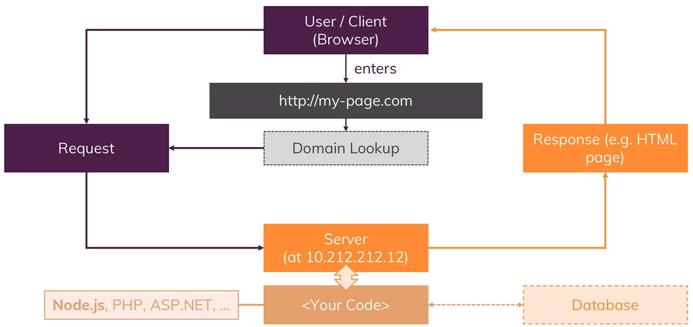
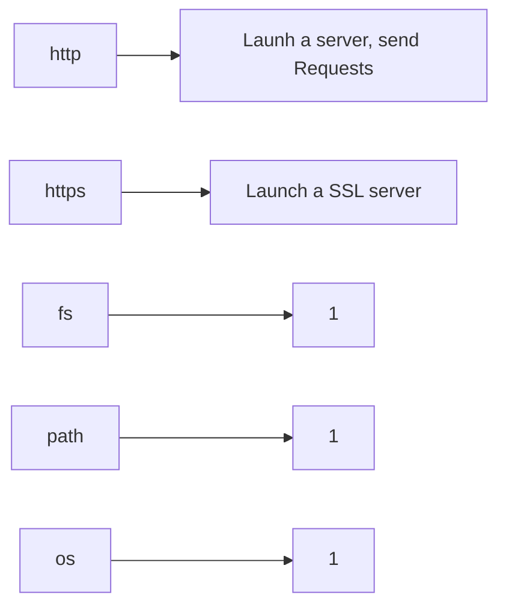

# 2. Node.JS: Understanding the Basics

## **Summary**
- How Does the Web Work (Refresher)?
- Creating a Node.js server
- Using Node Core Modules
- Working with Requests & Responses (Basics)
- Asynchronous Code & The Event Loop

## How Does the Web Work?

## **HTTP vs HTTPS**

### **H**yper **T**ext **T**ransfer **P**rotocol 
A protocol for Transferring Daa witch is understood by Browser and Server

### **H**yper **T**ext **T**ransfer **P**rotocol **S**ecure
HTTP + Data Encryption (during Transmission)

## Core Modules

